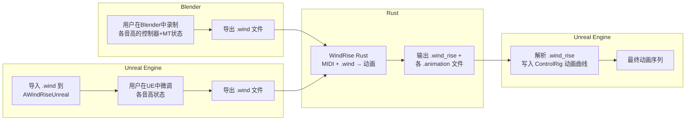

# WindRiseUnreal 模块设计方案

> 版本: 0.2.0 | 日期: 2026-07-18 | 作者: BigHippo78

---

## 一、概述

WindRiseUnreal 是 MusicDoll 插件的新乐器模块，对应**管乐器**（笛、箫、单簧管等）。演奏时嘴唇/口腔 Morph Target 参与发音，因此不设 LipSync 面板。核心工作流与 Blender 端 `wind_rise_blender` 对应，复用 Rust 端 `wind_rise_rust` 生成的动画数据。

### 1.1 与现有模块的关键差异

| 特性              | BeatBloom (鼓) | ZhengDrift (古筝) |  **WindRise (管乐)**  |
| ----------------- | :------------: | :---------------: | :-------------------: |
| Lip Sync          |     ✅ 有      |       ✅ 有       | ❌ 无（嘴已用于演奏） |
| 手部控制器        |       6        |        24         |   **14 + 10 pole**    |
| 脚部控制器        |       4        |         4         |         **4**         |
| Head 控制器       |       ✅       |        ✅         |          ✅           |
| 乐器 Morph Target |       ❌       |        ❌         |    **✅ 乐器 MT**     |
| 角色 Morph Target |       ❌       |        ❌         |  **✅ 嘴唇/口腔 MT**  |
| Breath Control    |       ❌       |        ❌         |      **✅ 新增**      |
| 数据持久化格式    |     .json      |       .json       |      **`.wind`**      |
| 动画汇总格式      |     .json      |       .json       |   **`.wind_rise`**    |

### 1.2 Breath Control 原理

Breath Control 的性质与 LipSync 模块里的 `lip_sync` control 完全相同：

- 它是一个 Control Rig Control（Transform 类型）
- 下面挂载多个 **Float Animation Channel**，每个 channel 的名称 = 一个人物 Morph Target 名称
- 动画生成时，人物 Morph Target 数据写入到这些 channel 中
- 初始化流程、channel 创建、动画写入全部复用已有的通用方法（参考 `ULipSyncUtility` / `UInstrumentMorphTargetUtility` 的模式）

### 1.3 外部依赖

- **Blender 端** (`wind_rise_blender`): 用户在 Blender 中录制的 `.wind` 角色配置（含每音高的控制器 + Morph Target 数据）
- **Rust 端** (`wind_rise_rust`): 从 MIDI + `.wind` 生成 `.wind_rise` 汇总文件及子动画文件

---

## 二、文件结构

```
Source/WindRiseUnreal/
├── WindRiseUnreal.Build.cs
├── Public/
│   ├── WindRiseUnreal.h              # 核心 Actor：AWindRiseUnreal
│   └── UI/
│       ├── WindRiseModuleMainPanel.h         # 主面板（Tab 容器）
│       ├── WindRiseModulePropertiesPanel.h   # 属性面板（Tab 1）
│       └── WindRiseModuleOperationsPanel.h   # 操作面板（Tab 2）
└── Private/
    ├── WindRiseUnreal.cpp
    ├── WindRiseUnrealModule.cpp      # 模块注册
    └── UI/
        ├── WindRiseModuleMainPanel.cpp
        ├── WindRiseModulePropertiesPanel.cpp
        └── WindRiseModuleOperationsPanel.cpp
```

共 **8 个文件**（对标 BeatBloom/ZhengDrift 的结构）。

此外，在 `MusicDollCommon` 中新增一个**通用 Morph Target 调整面板组件**供各模块复用。

---

## 三、核心数据结构：AWindRiseUnreal

### 3.1 继承关系

```
AInstrumentBase → AWindRiseUnreal ( implements FTickableGameObject )
```

- `AInstrumentBase` 已提供 `SkeletalMeshActor`（演奏者）、`IOFilePath`、`AnimationFilePath`
- 新增 `InstrumentMesh` 用于乐器 SkeletalMesh

### 3.2 无状态枚举

管乐的状态由"当前音高"一个维度决定，音高直接使用 MIDI 值（int32），无需封装为枚举。

### 3.3 UPROPERTY 成员

```cpp
// ========== 乐器引用（用户在 Details 面板上手选） ==========
UPROPERTY(EditAnywhere, BlueprintReadWrite, Category = "Basic Properties")
ASkeletalMeshActor* InstrumentMesh;       // 乐器骨骼网格

// ========== 角色配置 ==========
UPROPERTY(EditAnywhere, BlueprintReadWrite, Category = "WindRise Config")
FString InstrumentType;                   // 乐器类型 (chinese_dizi / flute / ...)
UPROPERTY(EditAnywhere, BlueprintReadWrite, Category = "WindRise Config")
int32 MinNote = 60;                       // 音域下限 MIDI 值
UPROPERTY(EditAnywhere, BlueprintReadWrite, Category = "WindRise Config")
int32 MaxNote = 84;                       // 音域上限 MIDI 值
UPROPERTY(EditAnywhere, BlueprintReadWrite, Category = "WindRise Config")
FString Description;                      // 乐器说明 / 指法描述（自由文本）

// ========== Morph Target 选择 ==========
UPROPERTY(EditAnywhere, BlueprintReadWrite, Category = "WindRise Morph Targets")
TArray<FString> CharacterMorphTargets;    // 演奏者脸上需要驱动的 MT 名称列表
UPROPERTY(EditAnywhere, BlueprintReadWrite, Category = "WindRise Morph Targets")
TArray<FString> InstrumentMorphTargets;   // 乐器上需要驱动的 MT 名称列表

// ========== 当前音高状态 ==========
UPROPERTY(EditAnywhere, BlueprintReadWrite, Category = "WindRise State")
int32 CurrentNote = 60;                   // 当前编辑的 MIDI 音高

// ========== 控制器映射（构造时硬编码） ==========
UPROPERTY()
TMap<FString, FString> HandControllers;    // 14 个手部控制器
UPROPERTY()
TMap<FString, FString> PoleControllers;    // 10 个 Pole Target 控制器（手指弯曲方向）
UPROPERTY()
TMap<FString, FString> FootControllers;    // 4 个脚部控制器
UPROPERTY()
TMap<FString, FString> HeadControl;        // 1 个头部控制器
UPROPERTY()
TMap<FString, FString> BreathControl;      // Breath Control（用于挂载人物 MT Float Channel）

// ========== 数据存储：音高→状态 ==========
UPROPERTY()
TMap<int32, FWindRiseNoteState> NoteStates;
```

### 3.4 FWindRiseNoteState 结构体

```cpp
USTRUCT(BlueprintType)
struct FWindRiseNoteState {
    GENERATED_BODY()

    UPROPERTY()
    int32 Note;                              // MIDI 音符号

    UPROPERTY()
    FString Name;                            // 音名（如 "C4"）

    UPROPERTY()
    TMap<FString, FTransform> Controllers;   // 控制器名 → 变换

    UPROPERTY()
    TArray<FMorphTargetValue> CharacterMT;   // 人物 MT（仅非零值）

    UPROPERTY()
    TArray<FMorphTargetValue> InstrumentMT;  // 乐器 MT（仅非零值）
};

USTRUCT(BlueprintType)
struct FMorphTargetValue {
    GENERATED_BODY()

    UPROPERTY()
    int32 MorphTargetIndex;    // 在 CharacterMorphTargets / InstrumentMorphTargets 中的索引

    UPROPERTY()
    float Value;               // 0.0 ~ 1.0
};
```

### 3.5 控制器映射

构造函数中硬编码：

```cpp
void AWindRiseUnreal::InitializeControllersAndRecorders() {
    // ========== 手部控制器（14 个） ==========
    HandControllers.Add(TEXT("left_palm"),               TEXT("H_L"));
    HandControllers.Add(TEXT("left_palm_ik_pivot"),      TEXT("HP_L"));
    HandControllers.Add(TEXT("left_thumb"),              TEXT("T_L"));
    HandControllers.Add(TEXT("left_index"),              TEXT("I_L"));
    HandControllers.Add(TEXT("left_middle"),             TEXT("M_L"));
    HandControllers.Add(TEXT("left_ring"),               TEXT("R_L"));
    HandControllers.Add(TEXT("left_little"),             TEXT("P_L"));
    HandControllers.Add(TEXT("right_palm"),              TEXT("H_R"));
    HandControllers.Add(TEXT("right_palm_ik_pivot"),     TEXT("HP_R"));
    HandControllers.Add(TEXT("right_thumb"),             TEXT("T_R"));
    HandControllers.Add(TEXT("right_index"),             TEXT("I_R"));
    HandControllers.Add(TEXT("right_middle"),            TEXT("M_R"));
    HandControllers.Add(TEXT("right_ring"),              TEXT("R_R"));
    HandControllers.Add(TEXT("right_little"),            TEXT("P_R"));

    // ========== Pole Target 控制器（10 个） ==========
    // 仅给用户手动调整手指弯曲方向，不做后续记录/动画处理
    PoleControllers.Add(TEXT("left_thumb_pole"),         TEXT("T_L_pole"));
    PoleControllers.Add(TEXT("left_index_pole"),         TEXT("I_L_pole"));
    PoleControllers.Add(TEXT("left_middle_pole"),        TEXT("M_L_pole"));
    PoleControllers.Add(TEXT("left_ring_pole"),          TEXT("R_L_pole"));
    PoleControllers.Add(TEXT("left_little_pole"),        TEXT("P_L_pole"));
    PoleControllers.Add(TEXT("right_thumb_pole"),        TEXT("T_R_pole"));
    PoleControllers.Add(TEXT("right_index_pole"),        TEXT("I_R_pole"));
    PoleControllers.Add(TEXT("right_middle_pole"),       TEXT("M_R_pole"));
    PoleControllers.Add(TEXT("right_ring_pole"),         TEXT("R_R_pole"));
    PoleControllers.Add(TEXT("right_little_pole"),       TEXT("P_R_pole"));

    // ========== 脚部控制器（4 个） ==========
    FootControllers.Add(TEXT("left_foot"),               TEXT("F_L"));
    FootControllers.Add(TEXT("left_foot_ik_pivot"),      TEXT("FP_L"));
    FootControllers.Add(TEXT("right_foot"),              TEXT("F_R"));
    FootControllers.Add(TEXT("right_foot_ik_pivot"),     TEXT("FP_R"));

    // ========== 头部控制器（1 个） ==========
    HeadControl.Add(TEXT("head_control"),                TEXT("Head_Control"));

    // ========== Breath Control（1 个，挂载人物 MT Float Channel） ==========
    BreathControl.Add(TEXT("breath"),                    TEXT("Breath_Control"));
}
```

总结：30 个控制器（14 手部 + 10 pole + 4 脚 + 1 头 + 1 Breath）。**不使用** Target 控制器（Middle_Hand、Look_At）和双线性辅助控制器。

### 3.6 核心方法

```cpp
// 状态管理
void SaveNoteState(int32 MidiNote);           // 保存所有控制器变换 + MT 值
void LoadNoteState(int32 MidiNote);           // 恢复所有控制器变换 + MT 值

// ControlRig 操作
void InitializePerformerControlRig();         // 初始化演奏者 CR（创建各控件 + Breath_Control）
void InitializeInstrumentControlRig();        // 初始化乐器 CR（创建 wind_root + MT Float Channel）
void CheckControlRigStatus();                 // 检查 Control Rig 控件状态

// .wind 导入/导出
void ImportWindFile(const FString& FilePath);
void ExportWindFile(const FString& FilePath);

// 动画生成
void GenerateAnimationFromWindRise(const FString& WindRiseFilePath);

// Morph Target 辅助（实时驱动 SkeletalMesh）
void SetCharacterMTValue(int32 Index, float Value);
void SetInstrumentMTValue(int32 Index, float Value);
void ResetAllCharacterMT();
void ResetAllInstrumentMT();
```

---

## 四、UI 设计

### 4.1 主面板布局（WindRiseModuleMainPanel）

```
┌────────────────────────────────────────────────────┐
│  [Properties]  [Operations]  [B/C Mapping]          │  ← Tab 切换
├────────────────────────────────────────────────────┤
│                                                      │
│  (当前 Tab 内容)                                     │
│                                                      │
└────────────────────────────────────────────────────┘
```

- **Tab 1（Properties）**: Config 编辑 + MT 选择列表 + Control Rig 初始化 + .wind 导入导出
- **Tab 2（Operations）**: 音高选择 + **人物 MT 调整** + **乐器 MT 调整** + Save/Load State + 乐器 CR 初始化 + .wind_rise 动画生成
- **Tab 3（B/C Mapping）**: 复用已有的 `SBoneControlMappingEditPanel`
- **无 LipSync Tab**

### 4.2 Tab 1：属性面板（WindRiseModulePropertiesPanel）

```
┌─ 属性面板 ─────────────────────────────────────────┐
│                                                      │
│  ┌─ Config ──────────────────────────────────────┐  │
│  │ Instrument Type: [                    ]        │  │
│  │ Description:     [     (多行文本)      ]        │  │
│  │ Min Note: [60]   Max Note: [84]                │  │
│  └──────────────────────────────────────────────┘  │
│                                                      │
│  ┌─ 人物 Morph Target（嘴唇/口腔） ──────────────┐  │
│  │ [下拉: Performer 全部 MT ▼] [添加]             │  │
│  │ ┌──────────────────────────────────────────┐   │  │
│  │ │ え                          [✕]          │   │  │
│  │ │ い                          [✕]          │   │  │
│  │ │ ω                           [✕]          │   │  │
│  │ └──────────────────────────────────────────┘   │  │
│  └──────────────────────────────────────────────┘  │
│                                                      │
│  ┌─ 乐器 Morph Target ───────────────────────────┐  │
│  │ [下拉: Instrument 全部 MT ▼] [添加]            │  │
│  │ ┌──────────────────────────────────────────┐   │  │
│  │ │ key_C_pressed               [✕]          │   │  │
│  │ │ key_D_pressed               [✕]          │   │  │
│  │ └──────────────────────────────────────────┘   │  │
│  └──────────────────────────────────────────────┘  │
│                                                      │
│  ┌─ Control Rig ────────────────────────────────┐  │
│  │ [Check Status]  [Initialize Performer CR]     │  │
│  └──────────────────────────────────────────────┘  │
│                                                      │
│  ┌─ .wind 文件 ─────────────────────────────────┐  │
│  │ Path: [                       ] [Browse...]   │  │
│  │       [Import .wind]  [Export .wind]           │  │
│  └──────────────────────────────────────────────┘  │
│                                                      │
└────────────────────────────────────────────────────┘
```

**与旧版的区别**：

- ❌ 移除：对象选择区域（用户在 Details 面板上完成）
- ❌ 移除：MT 预览/调整区域（移至操作面板）
- ✅ 新增：Initialize Performer CR 按钮（创建手/脚/头/Breath Control）

### 4.3 Tab 2：操作面板（WindRiseModuleOperationsPanel）

```
┌─ 操作面板 ─────────────────────────────────────────┐
│                                                      │
│  ═══ 音高状态录制 ═══                                │
│                                                      │
│  ┌─ 当前音高 ─────────────────────────────────────┐ │
│  │ Current Note: [C4 (60) ▼]                       │ │
│  └──────────────────────────────────────────────┘  │
│                                                      │
│  ┌─ 人物 Morph Target 调整 ───────────────────────┐ │
│  │                                                  │ │
│  │  え:  [==========●─────] 0.75  [Reset]          │ │
│  │  い:  [========●───────] 0.60  [Reset]          │ │
│  │  ω:   [●───────────────] 0.00  [Reset]          │ │
│  │                                                  │ │
│  │  (列出 CharacterMorphTargets 中每个 MT，         │ │
│  │   带独立的滑动条和 Reset 按钮，实时驱动           │ │
│  │   Performer SkeletalMesh)                        │ │
│  └──────────────────────────────────────────────┘  │
│                                                      │
│  ┌─ 乐器 Morph Target 调整 ───────────────────────┐ │
│  │                                                  │ │
│  │  key_C: [==========●─────] 0.80  [Reset]        │ │
│  │  key_D: [●───────────────] 0.00  [Reset]        │ │
│  │                                                  │ │
│  │  (列出 InstrumentMorphTargets 中每个 MT，         │ │
│  │   带独立的滑动条和 Reset 按钮，实时驱动           │ │
│  │   Instrument SkeletalMesh)                       │ │
│  └──────────────────────────────────────────────┘  │
│                                                      │
│  [Save State]   [Load State]                        │
│                                                      │
│  ═══ 乐器初始化 ═══                                  │
│                                                      │
│  [Initialize Instrument CR]                          │
│  （为乐器 Control Rig 创建 wind_root control，       │
│   并在其下添加 InstrumentMorphTargets 对应的          │
│   Float Animation Channel）                          │
│                                                      │
│  ═══ 动画生成 ═══                                    │
│                                                      │
│  ┌─ .wind_rise 文件 ──────────────────────────────┐ │
│  │ Path: [                       ] [Browse...]    │ │
│  └──────────────────────────────────────────────┘  │
│                                                      │
│  [Generate Animation]                               │
│                                                      │
└────────────────────────────────────────────────────┘
```

**功能说明**：

1. **音高选择**：下拉菜单 MinNote→MaxNote，显示 "C4 (60)" 格式

2. **MT 调整区（核心交互）**：
   - 用户在 Properties 面板里调整好控制器位置/旋转后，切换到 Operations 面板
   - 拖动人物/乐器的每个 MT 滑动条到正确值（实时驱动 SkeletalMesh）
   - 点击 **Save State** → 将当前音高对应的所有控制器 + MT 值保存到 `NoteStates[MidiNote]`
   - 点击 **Load State** → 从 `NoteStates[MidiNote]` 恢复到引擎

3. **乐器初始化**：
   - 调用类似 `ULipSyncUtility::InitializeLipSyncControl` 的方法
   - 在乐器 Control Rig 中创建 `wind_root` Control
   - 在 `wind_root` 下创建 Float Animation Channel，名称 = `InstrumentMorphTargets` 中的每项

4. **动画生成**：
   - 解析 `.wind_rise` → 读取各子 `.animation` 文件
   - 手部动画 → `UInstrumentAnimationUtility::BatchInsertControlRigKeys`
   - 人物 MT 动画 → 写入 `Breath_Control` 下的 Float Channel（同 LipSync 写入方式）
   - 乐器 MT 动画 → 写入 `wind_root` 下的 Float Channel（同 LipSync 写入方式）
   - 活动曲线 → 可选写入 Breath_Control 的额外 channel 或材质参数

### 4.4 Tab 3：B/C Mapping

直接复用 `SBoneControlMappingEditPanel`，无需开发。

---

## 五、数据流

### 5.1 整体工作流



### 5.2 .wind 文件格式

```json
{
  "config": {
    "instrument_type": "flute",
    "min_note": 60,
    "max_note": 84,
    "description": "长笛指法: ...",
    "force_shape_keys": ["え", "い", "ω", "口横缩げ"],
    "instrument_shape_keys": ["key_C_pressed"],
    "instrument_mesh_name": "flute_mesh"
  },
  "note_info": [
    {
      "note": 60,
      "name": "C4",
      "controllers": {
        "H_L": { "location": [0, 0, 0], "rotation": [1, 0, 0, 0] }
      },
      "character_shape_keys": [{ "shape_key_index": 0, "value": 1.0 }],
      "instrument_shape_keys": []
    }
  ]
}
```

**四元数顺序**：`.wind` 文件中 rotation 格式为 `[w, x, y, z]`，与 UE `FQuat(W, X, Y, Z)` 一致。导出时按 `W, X, Y, Z` 输出，导入时按相同顺序解析为 `FQuat`。**不需要坐标转换**。

### 5.3 .wind_rise 及子动画文件格式

**.wind_rise（汇总文件）**：

```json
{
  "left_hand_animation_file": "path/to/xxx_lefthand.animation",
  "right_hand_animation_file": "path/to/xxx_righthand.animation",
  "character_sk_animation_file": "path/to/xxx_character.animation",
  "instrument_sk_animation_file": "path/to/xxx_instrument.animation",
  "activity_curve_file": "path/to/activity_curve.json"
}
```

**手部动画 .animation**：

```json
[
  {
    "frame": 11.64,
    "hand_infos": {
      "H_L": [x, y, z, qw, qx, qy, qz],
      "HP_L": [x, y, z, qw, qx, qy, qz]
    },
    "state": "attack"
  }
]
```

**Morph Target 动画 .animation**：

```json
[
  { "frame": 11.64, "shape_key_name": "ω", "value": 1.0 },
  { "frame": 86.48, "shape_key_name": "ω", "value": 0.0 }
]
```

**活动曲线 activity_curve.json**：

```json
[
  { "frame": 0.0, "value": 0.0 },
  { "frame": 11.64, "value": 1.0 }
]
```

---

## 六、关键技术点

### 6.1 Breath Control 设计（类比 lip_sync）

```
LipSync:   lip_sync (Control) ─┬─ mouth_open (Float Channel)
                                ├─ lips_smile (Float Channel)
                                └─ ...

WindRise:  Breath_Control (Control) ─┬─ え (Float Channel)
                                       ├─ い (Float Channel)
                                       ├─ ω (Float Channel)
                                       └─ 口横缩げ (Float Channel)
```

- Breath_Control 是一个 Transform Control
- 下面挂多个 Float Animation Channel，名称 = `CharacterMorphTargets` 中的每一项
- 初始化时参考 `ULipSyncUtility::InitializeLipSyncControl` + `ApplyMappingToRig` 的模式
- 动画写入时参考 `UInstrumentMorphTargetUtility::WriteMorphTargetKeyframes`

### 6.2 乐器 wind_root Control

与 Breath_Control 类似，在**乐器**的 Control Rig 中创建 `wind_root` Control，下面挂载 `InstrumentMorphTargets` 对应的 Float Channel。初始化时参考相同模式。

### 6.3 通用 Morph Target 调整组件

在 `MusicDollCommon` 中新增通用组件：

```cpp
// 通用 MT 调整面板（放在 MusicDollCommon）
class MUSICDOLLCOMMON_API SMorphTargetAdjustPanel : public SCompoundWidget {
public:
    SLATE_BEGIN_ARGS(SMorphTargetAdjustPanel) {}
        SLATE_ARGUMENT(FString, Title)   // 面板标题
    SLATE_END_ARGS()

    // 设置 MT 名称列表 + 绑定的 SkeletalMeshComponent
    void SetMorphTargets(const TArray<FString>& Names, USkeletalMeshComponent* SkelComp);

    // 获取所有 MT 的当前值（用于 Save State）
    TArray<float> GetAllValues() const;

    // 设置所有 MT 的值（用于 Load State）
    void SetAllValues(const TArray<float>& Values);

    // 重置所有 MT 为 0
    void ResetAll();
};
```

WindRise 操作面板中放两个 `SMorphTargetAdjustPanel` 实例：一个绑定 Performer SkeletalMesh，一个绑定 Instrument SkeletalMesh。每个 MT 显示名称 + 0~1 滑动条 + Reset 按钮，值变更时实时调用 `USkinnedMeshComponent::SetMorphTarget()`。

### 6.4 动画写入方法

全部复用已有的通用方法：

| 动画类型 | 写入方法                                                                                                |
| -------- | ------------------------------------------------------------------------------------------------------- |
| 手部动画 | `UInstrumentAnimationUtility::BatchInsertControlRigKeys`                                                |
| 人物 MT  | `UInstrumentMorphTargetUtility::WriteMorphTargetAnimationToControlRig`（目标 Control = Breath_Control） |
| 乐器 MT  | `UInstrumentMorphTargetUtility::WriteMorphTargetAnimationToControlRig`（目标 Control = wind_root）      |

这与其他乐器模块（BeatBloom / ZhengDrift）的动画写入流程完全一致。

### 6.5 坐标与四元数

- **不需要坐标系转换**：Blender → Rust → Unreal 的数据流中，位置和旋转都是相对于各自世界的局部坐标
- 唯一需要注意：`.wind` 文件中四元数顺序为 `[w, x, y, z]`，导出时必须按 `W, X, Y, Z` 输出，导入时按相同顺序解析为 `FQuat`

---

## 七、施工计划

### Phase 1: 骨架搭建（模块注册 + 核心 Actor）

| #   | 任务                                                              | 文件      |
| --- | ----------------------------------------------------------------- | --------- |
| 1.1 | 创建 `WindRiseUnreal.Build.cs`                                    | Build.cs  |
| 1.2 | 创建 `WindRiseUnreal.h/.cpp`（AWindRiseUnreal 骨架 + 控制器映射） | .h + .cpp |
| 1.3 | 创建 `WindRiseUnrealModule.cpp`（模块注册）                       | .cpp      |
| 1.4 | 注册到 `MusicDoll.uplugin`                                        | .uplugin  |
| 1.5 | **编译验证**                                                      | —         |

### Phase 2: UI 面板骨架

| #   | 任务                                                      | 文件          |
| --- | --------------------------------------------------------- | ------------- |
| 2.1 | 创建 `WindRiseModuleMainPanel.h/.cpp`（3 Tab）            | .h + .cpp     |
| 2.2 | 创建 `WindRiseModulePropertiesPanel.h/.cpp`（骨架布局）   | .h + .cpp     |
| 2.3 | 创建 `WindRiseModuleOperationsPanel.h/.cpp`（骨架布局）   | .h + .cpp     |
| 2.4 | 集成 B/C Mapping（注册已有 SBoneControlMappingEditPanel） | MainPanel.cpp |
| 2.5 | **编译验证**                                              | —             |

### Phase 3: 通用组件 + 属性面板

| #   | 任务                                                            | 文件                                 |
| --- | --------------------------------------------------------------- | ------------------------------------ |
| 3.1 | 实现通用 `SMorphTargetAdjustPanel` 组件                         | MusicDollCommon                      |
| 3.2 | Config 字段编辑 UI（InstrumentType, Min/MaxNote, Description）  | PropertiesPanel                      |
| 3.3 | 人物/乐器 MT 添加/删除 UI                                       | PropertiesPanel                      |
| 3.4 | Control Rig 初始化（Performer：CreateControl + Breath_Control） | PropertiesPanel + WindRiseUnreal.cpp |
| 3.5 | .wind 导入/导出 UI + 后端逻辑                                   | PropertiesPanel + WindRiseUnreal.cpp |
| 3.6 | **编译验证**                                                    | —                                    |

### Phase 4: 操作面板功能

| #   | 任务                                             | 文件                                 |
| --- | ------------------------------------------------ | ------------------------------------ |
| 4.1 | 音高下拉菜单（MinNote~MaxNote，含音名）          | OperationsPanel                      |
| 4.2 | 人物 MT 调整面板（绑定 Performer SkeletalMesh）  | OperationsPanel                      |
| 4.3 | 乐器 MT 调整面板（绑定 Instrument SkeletalMesh） | OperationsPanel                      |
| 4.4 | Save State / Load State（控制器 + MT 值）        | OperationsPanel + WindRiseUnreal.cpp |
| 4.5 | 乐器 CR 初始化（wind_root + MT Float Channels）  | OperationsPanel + WindRiseUnreal.cpp |
| 4.6 | .wind_rise 解析 + 动画生成                       | OperationsPanel + WindRiseUnreal.cpp |
| 4.7 | **编译验证**                                     | —                                    |

### Phase 5: 集成测试

| #   | 任务                                                                     |
| --- | ------------------------------------------------------------------------ | --- |
| 5.1 | 端到端测试：Blender .wind → UE 导入 → 编辑 → Rust 动画生成 → UE 动画加载 |
| 5.2 | 四元数顺序验证                                                           |
| 5.3 | 错误处理完善                                                             |
| 5.4 | **最终编译验证**                                                         | —   |

---

> **请再次审阅，确认后开始施工。**
